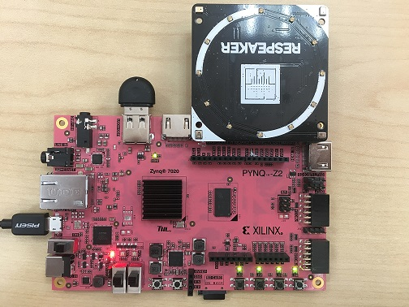
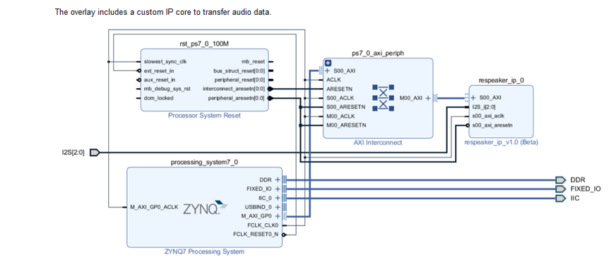

# ReSpeaker 4-Mic Array for PYNQ

This repo contains the pip install package for ReSpeaker 4-Mic Array on PYNQ. It's only support PYNQ Z2 board. There are 2 noetbooks in the design. DOA.ipynb is to calculate DOA (Direction Of Arrival) of the sound. STT.ipynb will show how to do STT (Speech To Text) with APIs provided by Baidu.

## Quick Start

In order to install it on your PYNQ board, connect to the board, open a terminal and type:

### Online Install
```shell
# (on PYNQ v2.3 or v2.4 only)
sudo pip3 install git+https://github.com/xupsh/pynq-respeaker.git
```
### Standalone Install
```shell
# (on PYNQ v2.3 or v2.4 only)
cd pynq-sense-hat
sudo python setup.py install
```

NOTE: This command must be run as root.  

### Connect ReSpeaker to PYNQ-Z2


### Run the examples

After the installation, a folder pynq-respeaker shuold be seen in `/home/xilinx/jupyter_notebooks`.There are 2 notebooks in it and you can run them.

## About the ReSpeaker and the project overlay  
### ReSpeaker
ReSpeaker is a 4-mic array with an AC108 4-channel ADC as a converter. ReSpeaker is designed as a Raspberry device.   
You can learn more about ReSpeaker by clicking [this](http://wiki.seeedstudio.com/ReSpeaker_4_Mic_Array_for_Raspberry_Pi/?_blank).  

### Cunstomed overlay  
AC108 support I2S interface, so we need to build our own overlay.  
  
The customed respeaker IP converts I2S signal and stored results in it. PS accesses those data via AXI_lite bus (MMIO in PYNQ ).
